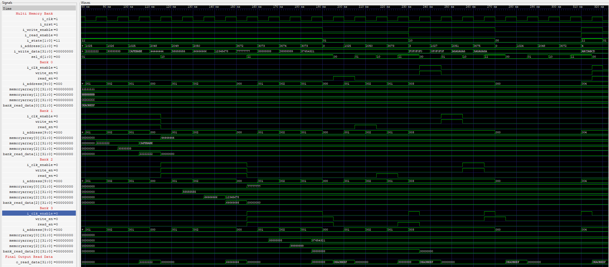

# 🔋 Low-Power Multi-Bank Memory (VHDL + Power Analysis)
This project demonstrates the design, simulation, and power analysis of a **low-power multi-bank memory** system written in **VHDL**.  
The design leverages **bank-level clock gating** and **state-based control** to reduce unnecessary switching activity and dynamic power consumption.  

---

## 📂 Repository Structure
```bash 
├── Images 
|    └── Image.png #Output waveform simulated in Xilinx Vivado
|    └── MultiMemoryBankOutput.png # Simulation waveform (multi-bank)
|    └── SingleMemoryBankOutput.png # Simulation waveform (single-bank)
├── sim 
|    └── work 
|    |    └── power_estimate_vcd.csv
|    |    └── result.gtkw
|    |    └── result.saif
|    |    └── result.vcd
|    |    └── switching_activity.csv
|    |    └── switching_activity_vcd.csv
|    |    └── vcd2saif.ipynb
|    └── compSim.sh # Shell script: GHDL + VCD dump + Python analysis
|    └── schematic.pdf
|    └── schematic.sch
|    └── tb_multi_bank_memory.vhd
|    └── tb_single_bank_memory.vhd
|    └── vcd_automation.py
├── src
    └── multi_bank_memory.vhd
    └── single_bank_memory.vhd
```

## 🖥️ Design Overview

### **Single Bank Memory**
- Supports two states via `i_state`:
  - `0` → **Idle** (read-only, no writes allowed).  
  - `1` → **Active** (full read/write allowed).  
- Implements simple synchronous memory with enable-controlled clocking.

### **Multi-Bank Memory**
- Composed of **4 independent banks**.  
- Bank selection is based on upper address bits (`i_address[11:10]`).  
- Each bank has **clock enable**, **read enable**, and **write enable** signals derived from global inputs.  
- Supports **fine-grained control**:
  - `"11"` → Active (read/write).  
  - `"10"` → Read-only.  
  - `"01"` → no operation but data in memory banks are intact.  
  - `"00"` → Idle (no operation - simulating power down) .  

## 🧪 Simulation Flow

Run simulation with:

```bash
./compSim.sh
```

This script:

Compiles the design with GHDL.

Runs tb_multi_bank_memory simulation.

Dumps waveform to result.vcd.

Generates switching activity and power analysis using vcd_automation.py.

Produces outputs:

result.vcd (VCD waveform)

result.saif (SAIF activity file)

switching_activity.csv (toggle + dwell + hamming)

Power estimation summary in terminal.

Opens GTKWave for interactive viewing.


## Power Analysis Methodology
- VCD Parsing 
- SAIF Generation
- Power Estimation 

## Outputs 


- Vivado RTL Schematic : See (sim/schematic.pdf)

Example Outputs
Toggle Activity Summary
====== VCD ANALYSIS SUMMARY ======
Signals         : 46
Total Toggles   : 1,002,641
Duration (s)    : 0.001
Avg Toggle Rate : ~1.0e9 toggles/s (bit-level)

Top Toggling Signals:
  tb.uut.i_clk                          → 200,000
  tb.uut.gen_banks(0).bank.i_clk        → 200,000
  tb.uut.gen_banks(1).bank.i_clk        → 200,000
  tb.uut.gen_banks(2).bank.i_clk        → 200,000
  tb.uut.gen_banks(3).bank.i_clk        → 200,000

  Estimated Power (sample)
====== ESTIMATED DYNAMIC POWER ======
Assumptions: VDD = 1.2 V, Ceff = 2e-15 F per bit

Signal                                    Power (W)     Energy (J)
tb.uut.i_clk                              5.76e-07      5.76e-10
tb.uut.gen_banks(0).bank.i_clk            5.76e-07      5.76e-10
tb.uut.i_write_data[31:0]                 1.13e-09      1.13e-12
tb.uut.o_read_data[31:0]                  6.91e-10      6.91e-13


## References 
- VCD file analysis adapted from : https://github.com/bfarnaghi/vcd-signal-tracker/blob/main/vst.py
- GHDL : https://github.com/ghdl/ghdl
- GTKWave : https://github.com/gtkwave/gtkwave